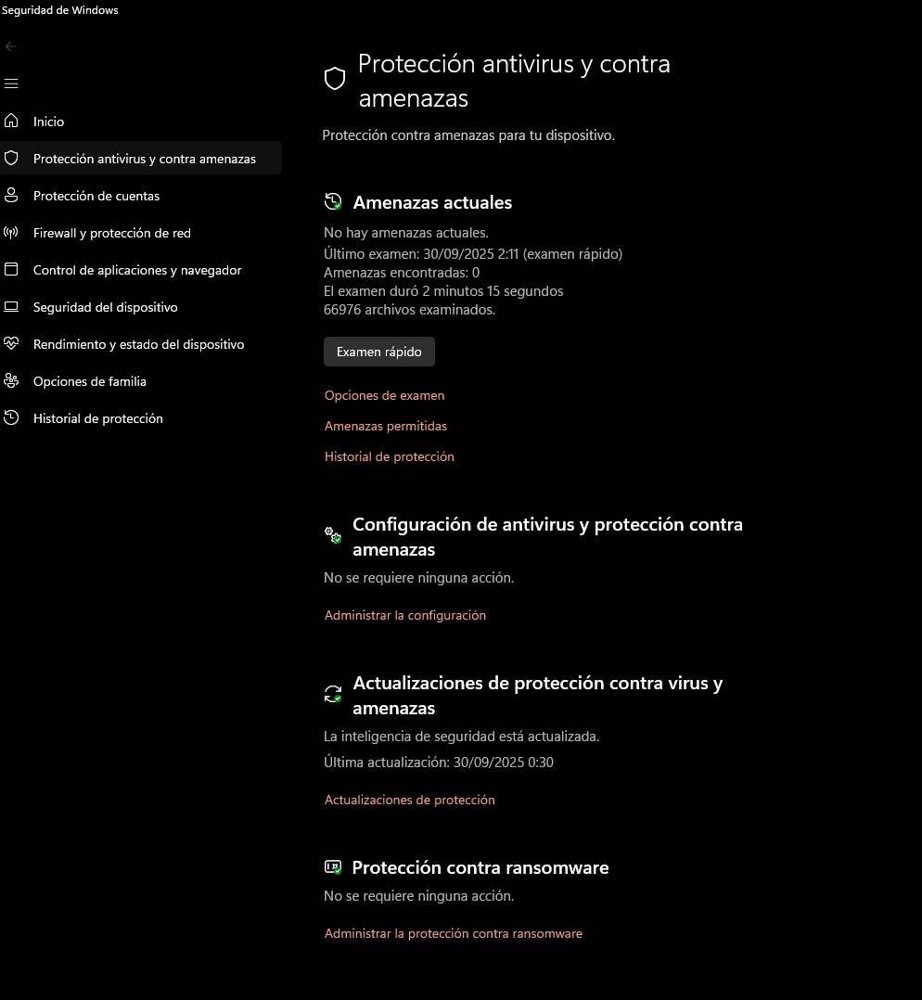
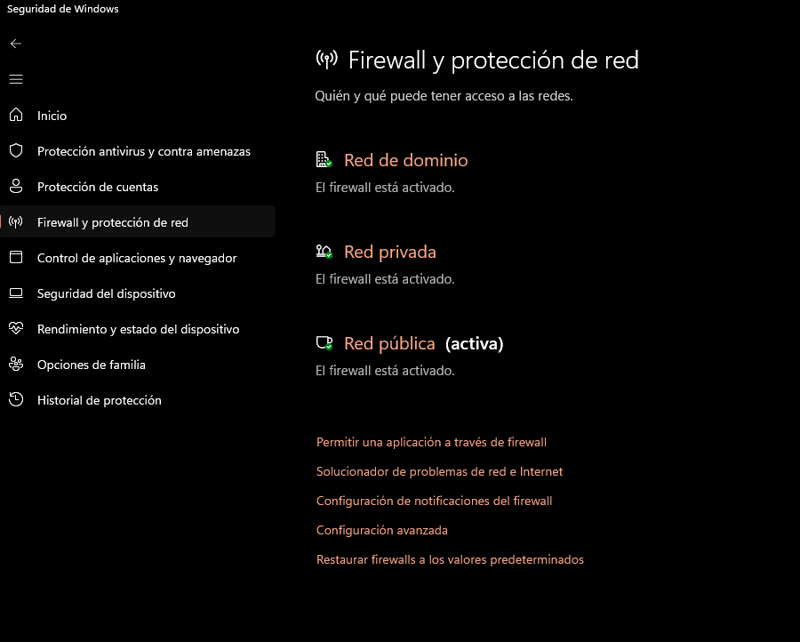

# Auditoría de Seguridad – Equipo Propio

## 1. Información del equipo

**Objetivo:** Presentar las características básicas y el estado de seguridad del equipo antes de realizar auditorías avanzadas.

| Elemento | Información |
|-----------|------------|
| Host | GABRIELPC |
| Sistema operativo | Windows 11 Pro, versión 10.0.26100 |
| Arquitectura | x64 |
| Procesador | Intel64 Family 6 Model 183 Stepping 1 GenuineIntel ~3500 MHz |
| RAM | Total: 32 GB, Disponible: 20,8 GB |
| Memoria virtual | Máx 34,6 GB, Disponible: 17,8 GB |
| Fabricante / Modelo | Gigabyte B760M DS3H DDR4 |
| Fecha de instalación | 21/08/2025 |
| Dominio / Grupo de trabajo | WORKGROUP |
| Configuración regional / zona horaria | Español (internacional), (UTC+01:00) Madrid |

**Estado de seguridad:**
- Antivirus: Windows Defender activo  
- Firewall: Activado  
- Seguridad basada en virtualización: No habilitado  
- App Control for Business: Forzado / Auditoría  

**Capturas:**
-   
- 

---

## 2. Escaneo de puertos con Nmap

**Objetivo:** Identificar puertos abiertos y servicios activos en el equipo.

**Host escaneado:** localhost (127.0.0.1)  
**Estado:** Host activo

**Puertos abiertos detectados:**

| Puerto | Servicio | Versión | Riesgo | Recomendación |
|--------|---------|---------|--------|---------------|
| 135/tcp | msrpc | Microsoft Windows RPC | Medio | Solo accesible localmente; no exponer a Internet |
| 445/tcp | microsoft-ds | ? | Alto | Evitar exposición a Internet; mantener firewall activo |
| 902/tcp | ssl/vmware-auth | VMware Authentication Daemon 1.10 | Bajo/medio | Solo relevante si se usa VMware; no exponer |
| 912/tcp | vmware-auth | VMware Authentication Daemon 1.0 | Bajo/medio | Solo relevante si se usa VMware; no exponer |

**Sistema detectado:**  
OS: Windows

**Captura:**
- 

**Conclusión:**  
Los puertos abiertos corresponden a servicios de Windows y VMware. Los puertos críticos (135 y 445) están protegidos por firewall y no están expuestos a Internet, cumpliendo las buenas prácticas básicas de seguridad.
